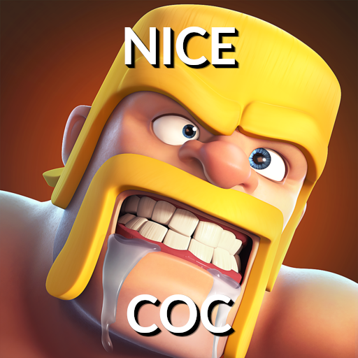

# NiceCoC

[**NiceCoC**](https://github.com/Ixirsii/NiceCoC) is an open
source bot which provides Clash of Clans information and notifications to
Discord.

## Requirements

NiceCoC requires the following software to be installed:

- [Java 21](https://adoptium.net/temurin/releases?version=21)
